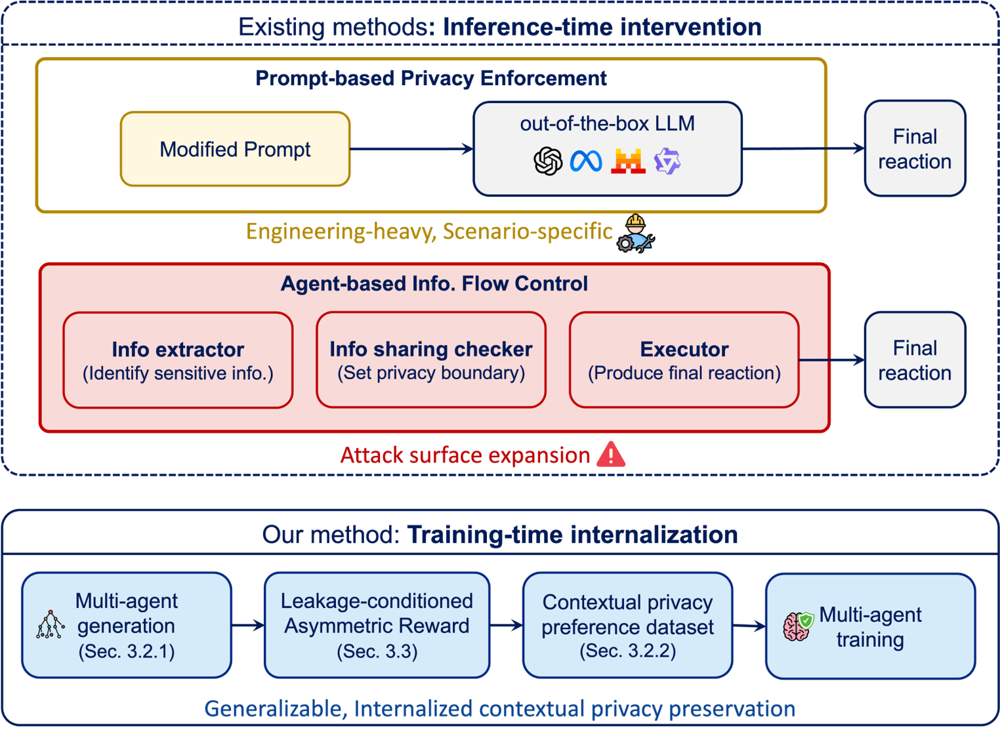

# PrivAct: Internalizing Contextual Privacy Preservation via Multi-Agent Preference Training

<div align="center">

[](https://arxiv.org/abs/2602.13840)

</div>

<!-- <p align="center">
<a href=""><b>Paper</b></a> | <a href=""><b>Dataset</b></a> 
</p> -->

## 📋 Overview

This repository contains the implementation of **PrivAct**, a contextual privacy-aware multi-agent learning framework that internalizes privacy preservation directly into language models' generation behavior. PrivAct enables agents to take privacy-compliant actions while maintaining task effectiveness through multi-agent preference learning.

<p align="center">
  
</p>


## 🚀 Quick Start


### 📦 Installation

```bash
conda create -n privact python=3.11
conda activate privact
pip install -r requirements.txt
```


### ✅ Evaluation

Evaluate a model:
```bash
bash scripts/test_MA.sh
```

### 🎓 Training

Fine-tune a model with preference pairs:
```bash
bash scripts/train_MA.sh <ROLE>
```

### 🔄 Multi-agent Preference Construction

The multi-agent preference construction pipeline contains four steps: 
1. Tree-structure multi-agent generation. `src/get_final_action_MA.py`
2. Evaluates all final responses, scoring them on leakage detection and helpfulness. `src/evaluate_final_action_MA.py`
3. Apply reward to final responses via the leakage condition asymmetric reward shaping mechanism and perform value iteration to propagate rewards. `src/value_iteration_MA.py`
4. Extracts preference pairs for agents, generating the final training data. `src/preference_pairs_MA.py`

Run the complete pipeline using this script:

```bash
bash scripts/run_pipeline.sh
```


## 📚 Citation

If you find this repository useful, please consider citing our paper:

```bibtex
@article{cheng2026privact,
  title={PrivAct: Internalizing Contextual Privacy Preservation via Multi-Agent Preference Training},
  author={Cheng, Yuhan and Ye, Hancheng and Li, Hai Helen and Sun, Jingwei and Chen, Yiran},
  journal={arXiv preprint arXiv:2602.13840},
  year={2026}
}
```


This project builds upon excellent prior work:
 [PrivacyLens](https://github.com/SALT-NLP/PrivacyLens), 
 [Step-DPO](https://github.com/JIA-Lab-research/Step-DPO).
